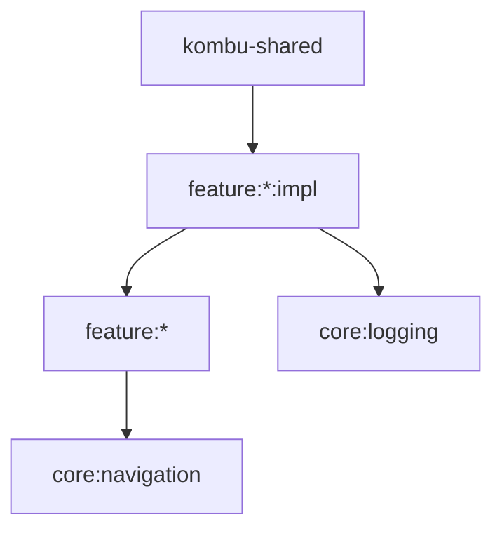

# Kombu - AI Agent Instructions

Kotlin Multiplatform analytics dashboard. Platforms: Android, iOS, JVM. Stack: Compose Multiplatform, Material 3, Koin, Navigation3.

## Constraints

```
❌ FORBIDDEN
─────────────────────────────────────
API → Impl dependencies
Impl → Other Impl dependencies  
Core → Feature dependencies
Shared/common resources module
Web/WASM targets
Hardcoded strings in UI
Declaring plugins already in scripts (ksp, serialization, android.multiplatform.library)
```

```
✅ REQUIRED
─────────────────────────────────────
Impl → API (via commonMainApi)
Impl → Core modules
Impl → Other feature APIs only
App → Feature Impl modules
Per-module resources in composeResources/
Alphabetical ordering in all lists (dependencies, includes, imports)
Register new modules in: settings.gradle.kts, kombu-shared/build.gradle.kts, AppModule.kt
```

## Architecture



| Module Type | Contains | Example |
|-------------|----------|---------|
| Feature API | `<Name>Destination` only | `:feature:signin` |
| Feature Impl | Screen, Navigation, Module, resources | `:feature:signin:impl` |
| Core | Shared utilities, no feature deps | `:core:navigation` |
| App | Aggregates all feature impl via Koin | `kombu-shared` |

## Templates

### Feature API Module

**Path**: `feature/<name>/build.gradle.kts`
```kotlin
ext { set("namespace", "dev.appoutlet.kombu.feature.<name>") }
apply(from = "$rootDir/gradle/script/feature.gradle")
```

**Path**: `feature/<name>/src/commonMain/kotlin/dev/appoutlet/kombu/feature/<name>/<Name>Destination.kt`
```kotlin
package dev.appoutlet.kombu.feature.<name>

import androidx.navigation3.runtime.NavKey
import kotlinx.serialization.Serializable

@Serializable
data object <Name>Destination : NavKey
```

### Feature Impl Module

**Path**: `feature/<name>/impl/build.gradle.kts`
```kotlin
plugins {
    alias(libs.plugins.kotlin.multiplatform)
    alias(libs.plugins.compose)
    alias(libs.plugins.compose.compiler)
}

ext { set("namespace", "dev.appoutlet.kombu.feature.<name>.impl") }
apply(from = "$rootDir/gradle/script/feature-impl.gradle")

dependencies {
    commonMainApi(project(":feature:<name>"))
}
```

**Path**: `feature/<name>/impl/src/commonMain/kotlin/dev/appoutlet/kombu/feature/<name>/impl/<Name>Screen.kt`
```kotlin
package dev.appoutlet.kombu.feature.<name>.impl

import androidx.compose.runtime.Composable

@Composable
fun <Name>Screen() {
    // UI implementation
}
```

**Path**: `feature/<name>/impl/src/commonMain/kotlin/dev/appoutlet/kombu/feature/<name>/impl/<Name>Module.kt`
```kotlin
package dev.appoutlet.kombu.feature.<name>.impl

import org.koin.core.annotation.ComponentScan
import org.koin.core.annotation.Module

@Module
@ComponentScan("dev.appoutlet.kombu.feature.<name>.impl")
class <Name>Module
```

### Navigation (when feature needs routing)

```kotlin
package dev.appoutlet.kombu.feature.<name>.impl

import androidx.navigation3.runtime.EntryProviderScope
import androidx.navigation3.runtime.NavKey
import dev.appoutlet.kombu.core.navigation.AppNavigation
import dev.appoutlet.kombu.feature.<name>.<Name>Destination
import kotlinx.serialization.modules.PolymorphicModuleBuilder
import org.koin.core.annotation.Single

@Single
class <Name>Navigation : AppNavigation<NavKey> {
    override fun setupRoute(scope: EntryProviderScope<NavKey>) {
        scope.entry<<Name>Destination> { <Name>Screen() }
    }

    override fun setupPolymorphism(builder: PolymorphicModuleBuilder<NavKey>) {
        builder.subclass(<Name>Destination::class, <Name>Destination.serializer())
    }
}
```

### String Resources

**Path**: `feature/<name>/impl/src/commonMain/composeResources/values/strings.xml`
```xml
<resources>
    <string name="<name>_title">Title</string>
</resources>
```

### ViewModel

```kotlin
@Factory
class <Name>ViewModel : ViewModel() {
    private val _state = MutableStateFlow<UiState>(UiState.Initial)
    val state = _state.asStateFlow()
}
```

## Registration

| File | Add (alphabetically) |
|------|-----|
| `settings.gradle.kts` | `include(":feature:<name>")` and `include(":feature:<name>:impl")` |
| `kombu-shared/build.gradle.kts` | `implementation(project(":feature:<name>:impl"))` |
| `kombu-shared/.../AppModule.kt` | `<Name>Module::class` in `FeatureModule` includes |

## Conventions

| Category | Convention |
|----------|------------|
| Package | `dev.appoutlet.kombu.feature.<name>` / `.impl` |
| Files | `<Name>Screen.kt`, `<Name>Navigation.kt`, `<Name>Module.kt`, `<Name>ViewModel.kt` |
| Resources | `composeResources/values/strings.xml`, snake_case IDs |
| Navigation | `navigator.navigate(Destination)`, `navigator.goBack()` |
| DI | `@Single` singletons, `@Factory` instances, `koinInject<T>()` in composables |
| Impl Plugins | Only 3: `kotlin.multiplatform`, `compose`, `compose.compiler` |

## Platform-Specific Code

```kotlin
// commonMain
expect fun platformFunction(): String

// androidMain
actual fun platformFunction() = "Android"

// iosMain
actual fun platformFunction() = "iOS"

// jvmMain
actual fun platformFunction() = "JVM"
```

## Commands

```bash
./gradlew build                          # Build all
./gradlew :android:assembleDebug         # Android
./gradlew :desktop:build                 # Desktop
./gradlew :feature:<name>:impl:build     # Feature
./gradlew detekt                         # Lint
```
